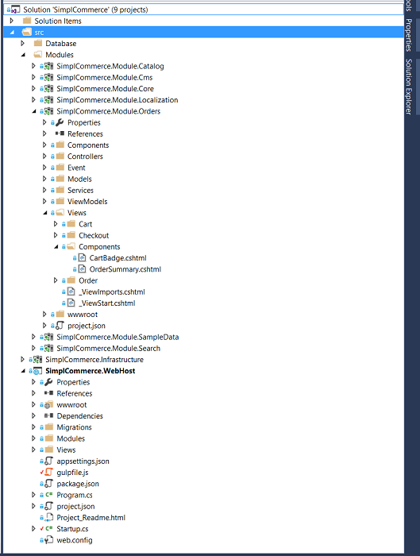

# Introduction to SimplCommerce

SimplCommerce is a simple, cross platform, modularized ecommerce system built on .NET Core.

---

## SimplCommerce is built based on

- ASP.NET MVC Core 3.1
- Entity Framework Core 3.1
- ASP.NET Identity Core 3.1
- Angular 1.6.3
- MediatR 7.0.0 for domain event

## The architecture highlight



The application is divided into modules. Each module contains all the stuff for itself to run including Controllers, Services, Views and even static files. If a module is no longer need, you can simply just delete it by a single click.

The SimplCommerce.WebHost is the ASP.NET Core project and acts as the host. It will bootstrap the app and load all the modules it found in the [modules.json](https://github.com/simplcommerce/SimplCommerce/blob/master/src/SimplCommerce.WebHost/modules.json). The source code of modules are placed outside the WebHost, in the [/src/Modules folder](https://github.com/simplcommerce/SimplCommerce/tree/master/src/Modules). .

During the application startup, the host will look up the modules.json and load all the modules it found in that file. If the module is not bundled with the Host then it will scan for all the *.dll in that Modules folder and load them up using AssemblyLoadContext. These assemblies will be then registered to MVC Core by the AddApplicationPart method.

A ModuleViewLocationExpander is implemented to help the ViewEngine can find the right location for views in modules.

#### For Entity Framework Core
Every domain entity needs to inherit from Entity, then on the "OnModelCreating" method, we find them and register them to the DbContext:
```cs
    private static void RegisterEntities(ModelBuilder modelBuilder, IEnumerable<Type> typeToRegisters)
    {
        var entityTypes = typeToRegisters.Where(x => x.GetTypeInfo().IsSubclassOf(typeof(Entity)) && !x.GetTypeInfo().IsAbstract);
        foreach (var type in entityTypes)
        {
            modelBuilder.Entity(type);
        }
    }
```
By default domain entities are mapped by convention. In case you need to some special mapping for your model. You can create a class that implements the ICustomModelBuilder for example:
```cs
    public class CatalogCustomModelBuilder : ICustomModelBuilder
    {
        public void Build(ModelBuilder modelBuilder)
        {
            modelBuilder.Entity<ProductLink>()
                .HasOne(x => x.Product)
                .WithMany(p => p.ProductLinks)
                .HasForeignKey(x => x.ProductId)
                .OnDelete(DeleteBehavior.Restrict);
        }
    }
```
